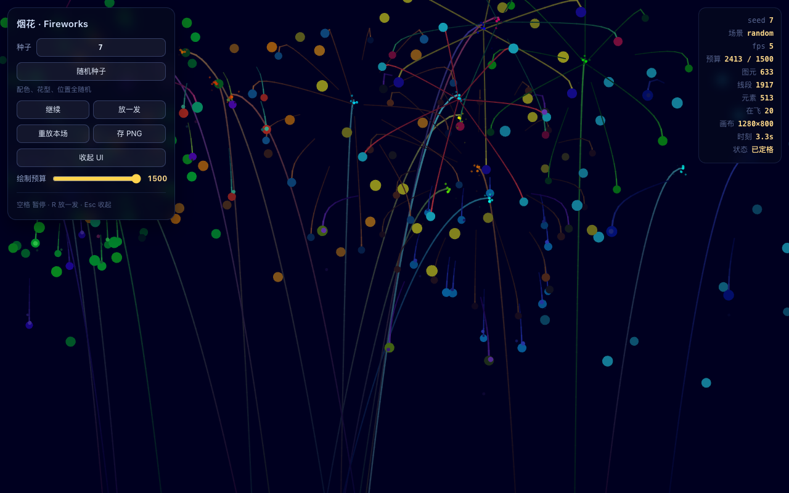
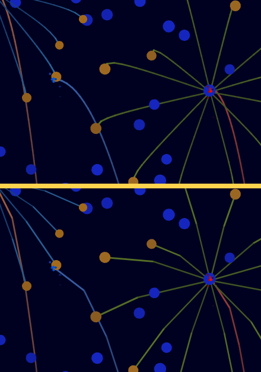

# 烟花 · Fireworks

浏览器 canvas 的烟花秀：配色、发射点、爆心、花型、寿命、尾迹全部程序化随机。

这一版是**维护版**：它由 `turtle_fireworks.py`（Python + turtle，1171 行）移植而来，但原版受
turtle 限制（没有带粗细的折线图元，只能靠图章预算硬凑）已经很难继续加东西，冻结成历史基线；
新特性都加在这里。



（门面那张是"按住 R 打满"的样子，用
`npm run shot -- --url "?seed=7&frames=1&max=1500" --spam 16 --step 200` 截的：先冻住、
真键盘按 16 次 R、再同步推 200 帧。画面逐像素可复现，只有 HUD 里的 fps 读数会变。）

## 快速开始

```bash
npm start          # 零依赖 Node 服务器，打开 http://127.0.0.1:9240/
npm run build      # 单文件版 dist/turtle_fireworks.html（双击就能放）
npm run verify     # 体检 + 自检 + 行为基线（日常就这一条）

npm i              # 只有"浏览器级自检 / 截图"才需要：playwright-core
npm run browser    # 真浏览器端到端自检（Playwright 驱动**系统已装的** Chromium）
```

| 形态 | 命令 | 产物 |
| --- | --- | --- |
| 开发 | `npm start` | `index.html` + `src/*.js` 十个模块，按 `src/manifest.json` 顺序注入（manifest 每次请求都重读，不用重启）。端口 9240，`--port` 可改 |
| 交付 | `npm run build` | 一个自包含 HTML：**70.1 KB（gzip 23.8 KB）**，零外部请求，`file://` 直接跑。构建后自检"自包含 / 无外部脚本 / 模块齐全"；产物可复现（不含时间戳，`--stamp` 才写） |

## 种子

**种子框只收数字**：数字种子 → 纯随机秀，同一个数字每次都是同一场，且与 CPython
`random.Random` 逐位一致（`npm run rng` 守着这条）。

还有一个词是例外。往种子里敲字母时，**只有正好接上那个词的一个字符才留得下来**，敲错了当场
被弹回去（输入框会抖一下）—— 所以"一个一个字母试"本身就有反馈。拼全的那一刻，开场换成
参考图风格：左右两发照参考图的配色与花型。

那个词写在 `src/app.js` 的 `SECRET` 一行里，换掉它提示里的字母个数会自动跟着变。
`?scene=classic|random` 可显式指定场景（覆盖推断），`?seed=<那个词>` 也认，方便分享。

## 尾迹

原版的尾迹一节一节的，纯粹是 turtle 的限制：没有"带粗细的折线"图元，只能把真实轨迹抽稀成
2~6 段（`trail_seg` 的注释就叫**图章预算**），每段单独盖一个矩形图章。canvas 有 `stroke()` +
圆头圆角，于是一条真实轨迹就是**一整条路径**：沿已算好的真实轨迹细采样（火花 14 段、发射尾迹
48 段封顶），连成光滑带子，接头由圆头补齐、没有豁口；每段仍按原公式取色取宽，"越旧越暗越细"
的渐变照旧。



（上：现在的圆头描边；下：当年 turtle 口径的 2~6 段折线。同一 seed 同一帧，火花圆点位置
完全一致 —— 这张对比图是当年切换画法时留下的。）

图元只剩两种：**圆点**（正 18 边形，turtle 那份形状表）和**折线**。

### 绘制预算

每帧的绘制预算按**实际开销**算：折线按段数、圆点各算 1，默认 450（面板上的「绘制预算」）。

预算是**画面容量**，不是硬上限 —— 空着就多发、每发更大，满了就少发、每发更小（同时作用于
"每发多少颗"和"多久放一发"）：

| 预算 | 图元均值 | 图元峰值 |
| --- | --- | --- |
| 450（默认） | 68 | 206 |
| 900 | 113 | 286 |
| 1400 | 173 | 567 |

（random 场景 60 秒实测；表里是画面上真正的图元对象数。）节流是启发式的，单帧峰值会超过
预算（实测约为预算的 1.2~2 倍，齐射是瞬时的），HUD 里的「预算」一行就是 `上一帧 / 上限`，
看得出来滑块在起什么作用。画不动就往下调。

## 三层校验

需要的不是"像不像原版"，而是**改东西时别无意中改坏别的东西**：

| 层 | 命令 | 作用 |
| --- | --- | --- |
| **行为基线** | `npm run baseline` | 每帧指纹 = `sha256(RNG 624 状态字 + 图元流 + 预算/元素数 + 渲染绘制指令)`，4 组 × 400 帧。不需要 python3 与浏览器，几秒跑完；只有**没打算改**的东西变了才失败，有意改就 `baseline:update` 重录 |
| **Node 自检** | `npm run smoke` | 假 canvas 校验参数合法性 / 图元是否全被识别 / 绘制开销；直接构造 `App` 手动推帧，验证定格帧、固定步长、暂停、异常兜底、种子规则与逐字符守卫（13 收 / 6 拒）；并验证**调大预算真的会让画面变密**（450 → 1400 均值/峰值都要明显上升） |
| **真浏览器** | `npm run browser` | Playwright 驱动系统 Chromium，真开页面、真打字、真按键：① `file://` 打开构建产物，断言"没报错 / 标题对 / 画面非空 / 场景与种子一致 / `?ui=0` 彻底无 UI"；② 开发服务器的多文件页面，比对注入的 `<script>` 列表 == manifest、控制台便条只提字母个数不写出那个词，并**逐字符真敲**一遍那个词、验证快捷键（滑块聚焦时 R 要能放、种子框打字时 R 不放、回车收焦点、Esc 随时有效） |
| 跨语言随机数 | `npm run rng` | 与 CPython `random.Random` 逐位对拍（需 python3） |

基线能抓什么，实测：

```
# 改物理：spoke 的 drag 5.0 → 5.2
 FAIL  classic/seed=7   第 76 帧起行为变化 (预算 95 → 95，元素 69 → 69，线段 70 → 70)
（只有真的炸出 spoke 的那几个 seed 失败，其余照旧通过）

# 改渲染：圆头描边改成平头（物理与图元流完全没动）
 FAIL  classic/seed=7   第 7 帧起行为变化     ← 老口径看不到这一类

# 删掉复刻场景那次
  ~ original/seed=7     移除                ← 只报这一条，其它场景指纹一个字节没变
```

## 新特性往哪儿加

| 想加什么 | 改哪里 |
| --- | --- |
| 新花型 / 调参数区间 | `src/data.js` 的 `STYLES`（`count/radius/dot/drag/life/gravity/jitter/trail/ember/float_up/spread`），加完自动进随机池 |
| 新配色套路 | `src/data.js` 的 `randomPalette`；固定配色用 `Palette(...)` |
| 新图元 | `data.js` 加 shape 常量 + 构造函数，`view.js` 的 `shape()` 加一个分支（`smoke` 会检查"每个图元都被识别"） |
| 新元素 | 继承 `src/elements.js` 的 `Element`，实现 `update(dt)` / `frame()`，用 `show.add()` 注册；预算按 `data.drawnCost` 结算 |
| 换那个词 / 改种子规则 | `src/app.js` 的 `SECRET`、`seedContentOk()`、`sceneForSeed()`；哈希在 `src/rng.js` |
| 新场景编排 | `src/show.js` |
| UI / 交互 | `index.html` + `src/ui.js`（全部 DOM，含逐字符守卫与控制台便条）；主循环在 `src/app.js`（不碰 DOM，可在 Node 里测） |
| 体量红线 | 每个文件 ≤ 300 行，`npm run check` 把关；目前最大 `src/app.js` 224 行 |

改完固定动作：`npm run verify`；涉及页面再加 `npm run build && npm run browser`。

页面起不来时会自己说话：`index.html` 里有一段兜底自检，1.5 秒内没创建出 App 实例就把原因写在
页面上（并列出已加载的模块）—— 少加载一个模块以前只表现为"空白画面 + 控制台零输出"。

## 操作与参数

| 操作 | 键 / 按钮 |
| --- | --- |
| 暂停 / 继续 | 空格 或「暂停」 |
| 追加一发 | R 或「放一发」 |
| 收起面板 | Esc 或「收起 UI」 |
| 换种子 | 「随机种子」；想换开场就往种子里敲字母 |
| 注意 | 在种子框里打字时，空格 / R 让位给输入（那是彩蛋的输入）；回车或点一下画面就把键盘还给快捷键，Esc 任何时候都有效 |
| 重放 / 存图 | 「重放本场」/「存 PNG」 |
| 画面容量 | 「绘制预算」滑块（80~1500，默认 450） |

URL 参数：`?seed=7`、`?scene=classic|random`、`?frames=90`、`?still=1`、`?ui=0`、`?max=900`、
`?w=924&h=691`

* `frames=N` 先走 N 个固定步再定格（第 1 帧 = `step(0)`）；`still=1` 等价于 `frames=1`
* `ui=0` 隐藏全部 UI；`w`/`h` 钉死逻辑坐标系（构图与窗口大小无关，方便截图与复现）

## 模块地图

| 文件 | 行数 | 内容 |
| --- | --- | --- |
| `src/core.js` | 89 | `hsv / fade / mix / toHex`、`decimate`、banker's rounding |
| `src/rng.js` | 168 | MT19937 + CPython 播种（数字种子逐位一致）、文字种子 FNV-1a |
| `src/data.js` | 114 | 配色、圆点/折线图元、花型参数表 |
| `src/elements.js` | 186 | 图元基类、爆心闪光、余烬、火星（真实轨迹尾迹） |
| `src/trails.js` | 99 | 弹体、发射尾迹 |
| `src/firework.js` | 141 | 发射 → 顶点炸开 |
| `src/show.js` | 165 | 每帧顺序、绘制预算（容量）与节奏、两个场景、齐射 |
| `src/view.js` | 119 | canvas 渲染器：仿射变换 + 整屏重绘 + 折线圆头描边 |
| `src/app.js` | 224 | 应用核心：状态、种子规则、固定步长主循环（**不碰 DOM**） |
| `src/ui.js` | 199 | 全部 DOM：控制台、HUD、键盘、存 PNG、逐字符守卫、启动 |

数据流：`ui.js` → `app.js`（固定步长）→ `show.js`（每帧顺序）→ `elements/trails/firework`
产出图元流 → `view.js` 画到 canvas。

## 目录

```
index.html            页面外壳 + 控制台/HUD + 兜底自检（单文件构建的模板）
server.js             零依赖开发服务器（每次请求重读 manifest 并注入模块）
build.js              npm run build：体量体检 + 打包可复现的单文件 + 产物自检
src/                  10 个模块 + manifest.json（加载顺序）
reference/            原版 turtle_fireworks.py（只读留档，无脚本依赖它）
tools/
  baseline.js|json    行为基线：录制 / 比对每帧指纹（日常主力）
  render_smoke.js     Node 自检：假 canvas 渲染 + 主循环 + 种子规则
  fake_canvas.js      假 canvas 上下文 + window/rAF 桩 + 模块加载
  pw.js               Playwright + 开发服务器的公共件（驱动系统 Chromium）
  browser_check.js    真浏览器自检：交付产物 + 开发服务器 + 便条 + 打字 + 快捷键
  shot.js             截图（--spam N 按 N 次 R、--step M 再推 M 帧，结果确定可复现）
  rng_check.js        MT19937 与 CPython 逐位对拍（需 python3）
  dump_rng.py|js      随机数序列导出（rng_check 用）
  loader.js           在 Node 里按顺序加载 src 模块
dist/                 npm run build 的产物：单文件版 turtle_fireworks.html
docs/preview/         预览图（无头浏览器实拍）
```
