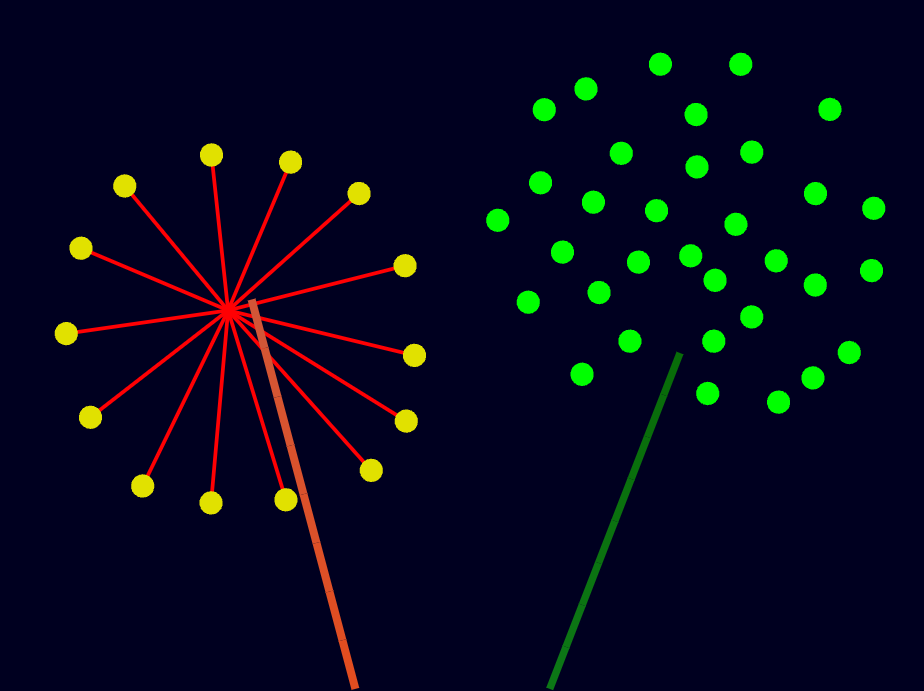

# 烟花 · Canvas（维护版）

浏览器 canvas 的烟花秀：程序化生成的配色、发射点、爆心、花型、寿命、尾迹全部随机，
三种开场场景（参考图风格 / 纯随机 / 按截图实测坐标复刻）。

**这一版是维护版。** 它由 `turtle_fireworks.py`（Python + turtle，1171 行）移植而来，
但原版受 turtle 的限制（没有带粗细的折线图元、只能靠图章预算硬凑）已经很难继续加东西，
**已经冻结成历史基线；新特性都加在这里**，不必再迁就它。




## 快速开始

```bash
npm start          # 零依赖 Node 服务器，打开 http://127.0.0.1:9240/
npm run dev        # 同上，并自动开浏览器
npm run build      # 打出单文件版 dist/turtle_fireworks.html（双击就能放）
npm run check      # 体量体检：每个文件是否 ≤ 300 行
```

不需要 `npm install`：整个项目只用 Node 内置模块（`http` / `fs` / `path` / `zlib` / `vm` / `crypto`）。

| 形态 | 命令 | 产物 |
| --- | --- | --- |
| 开发 | `npm start` | `index.html` + `src/*.js` 九个模块，按 `src/manifest.json` 顺序注入 `<script>`，改完刷新即可（`no-store`）。默认端口 **9240**（取自参考图宽度 924，避开 Vite 的 5173 等工具链默认端口），`--port` 或 `PORT=` 可改 |
| 交付 | `npm run build` | 内联成一个自包含 HTML：**69.3 KB（gzip 22.9 KB）**，零外部请求，`file://` 直接跑；产物**可复现**（不含时间戳，同样源文件字节一致，`--stamp` 才写） |

## 和 Python 原版的关系

原版不再是要"必须对齐"的规格，它现在是两样东西：

1. **移植来源**：构图、配色、花型参数的出处（`reference/turtle_fireworks.py` 原样留档）。
2. **历史基线**：`npm run verify` 仍能逐帧、逐像素跟它对拍，用来回答"移植本身有没有走样"，
   以及以后分辨"这是我改的，还是当初移植就错了"。**一旦为了新特性改了物理或随机数，它必然
   失败 —— 那是预期内的，不是 bug。**

需要保真对照时才用 `?exact=1`（回到原版的 2~6 段折线渲染口径）。

## Canvas 增强：光滑尾迹

原版的尾迹一节一节的，纯粹是 turtle 的架构限制：没有"带粗细的折线"图元，只能把真实轨迹抽稀
成 2~6 段（`trail_seg` 的注释就叫**图章预算**），每段单独盖一个矩形图章。canvas 有 `stroke()`
+ `lineCap/lineJoin = 'round'`，于是一条真实轨迹可以是**一整条路径**：沿已算好的真实轨迹细采样
（火花 14 段、发射尾迹 48 段封顶），圆头圆角连成光滑带子，接头由圆头补齐、没有豁口；每段仍按
原公式取色取宽，"越旧越暗越细"的渐变照旧；参考图那 14 条直线辐条按定义就是直线，不参与细采样。


（上：光滑尾迹；下：原版折线口径。同一 seed 同一帧，火花圆点位置完全一致。）

面板上的「光滑尾迹」可以**运行中随时开关**（只改画法不动物理）。它不影响演出的证明方式见
下面的行为基线：增强模式下逐帧比对 MT19937 全部 624 个状态字摘要，400 帧 × 3 场景全等。

## 三层校验

维护版真正需要的不是"像不像原版"，而是**改东西时别无意中改坏别的东西**，所以校验分成三层，
各管一件事：

| 层 | 命令 | 作用 | 什么时候该失败 |
| --- | --- | --- | --- |
| **行为基线** | `npm run baseline` | 每帧指纹 = `sha256(RNG 624 状态字 + 图元流 + 预算/元素数 + 渲染绘制指令)`，10 组 × 400 帧 | 只有**你没打算改**的东西变了才失败。有意改行为就 `npm run baseline:update` 重录，并逐条 review 差异 |
| **渲染自检** | `npm run smoke` | 假 canvas 校验参数合法性（NaN/线宽/颜色）、图元是否全被识别，并给出绘制开销 | 渲染器接不住新图元、坐标算出 NaN、颜色漏传 |
| **移植考古** | `npm run verify` / `verify:render` | 与 Python 原版逐帧 / 逐像素对拍 | 只在确认"移植有没有走样"时看；改新特性后失效属预期 |

基线不需要 python3、不需要浏览器，几秒跑完 —— 它是日常开发里真正会天天跑的那一层。它确实能
抓东西，实测：

```
# 改物理：spoke 的 drag 5.0 → 5.2
 FAIL  classic/seed=7/dense   第 76 帧起行为变化 (预算 95 → 95，元素 69 → 69，线段 70 → 70)
 FAIL  random/seed=42/dense   第 78 帧起行为变化
（只有真的炸出 spoke 的那几个 seed 失败，其余 6 组照旧通过）

# 改渲染：圆头描边改成平头（物理与图元流完全没动）
 FAIL  classic/seed=7/dense   第 7 帧起行为变化
（5 个"光滑尾迹"组失败；5 个"原版口径"组照旧通过 —— 它们用矩形填充，与线帽无关）
```

移植考古这一层的历史成绩（证明移植是忠实的，不是照着效果重写）：

| 层面 | 怎么比 | 结果 |
| --- | --- | --- |
| 随机数 | 8 个 seed × 134 次 `random/randint/uniform/choice`，与 CPython `random.Random` 逐位比 | **1072/1072 完全相同** |
| 仿真 | 同 scene/seed，固定 1/60 步长跑 400 帧，逐帧比对每个图元的形状/颜色/位置/朝向/粗细/长度 | **约 143 万项在 1e-9 容差内一致，最大偏差 2.3e-12** |
| 渲染 | 原版 `--render`（软件光栅化）vs 单文件版截图（`?exact=1`），924×691 | **IoU 96.1%~99.1%，MAE 0.40~0.47 / 255**（残余差异来自抗锯齿实现，不是构图） |

## 新特性往哪儿加（维护版约定）

| 想加什么 | 改哪里 | 注意 |
| --- | --- | --- |
| 新花型 / 调参数区间 | `src/data.js` 的 `STYLES`（`count/radius/dot/drag/life/gravity/jitter/trail/ember/float_up/spread`） | 加完自动进随机池；`baseline:update` |
| 新配色套路 | `src/data.js` 的 `randomPalette`；固定配色用 `Palette(...)` | 与 `show.js` 的场景配合 |
| 新图元（画法） | `data.js` 加 shape 常量 + 构造函数，`view.js` 的 `shape()` 加一个分支 | `npm run smoke` 会检查"每个图元都被识别" |
| 新元素（会动的东西） | 继承 `src/elements.js` 的 `Element`，实现 `update(dt)` / `frame()`，用 `show.add()` 注册 | `Show.step` 的调用顺序只在对拍原版时才需拘泥 |
| 新场景编排 | `src/show.js` 的 `classicOpening` / `originalScene` / `step` 的发射节流 | |
| UI / 交互 | `index.html` + `src/app.js` | **`app.js` 已 277/300 行**，下一个 UI 特性前先拆出 `src/ui.js` |
| 体量红线 | 每个文件 ≤ 300 行，`npm run check` 把关 | 拆文件优先于放长文件 |

改完的固定动作：`npm run check` → `npm run smoke` → `npm run baseline`。

### 已知的可清理项（等你点头，都有代价）

1. **图元预算的口径**：现在按 Python 图章口径结算（兼容层）。canvas 的真实开销是描边段数，
   改成按 `renderer.segs` 结算更合理 —— 代价是演出会变密/变稀（一次性重录基线）。
2. **兼容层整段删除**：`?exact=1` 分支、`pathGeo` 的 `cost` 字段、`Show.step` 里的 cost 结算，
   约 60 行。确认以后再也不需要跟原版对拍就可以删掉，代码会更直。
3. **`src/app.js` 拆分**：277 行里混了主循环、键盘、控制台、HUD，拆成 `app.js` + `ui.js` 更稳。

## 操作与参数

| 操作 | 键 / 按钮 |
| --- | --- |
| 暂停 / 继续 | 空格 或「暂停」 |
| 追加一发 | R 或「放一发」 |
| 收起面板 | Esc 或「收起 UI」 |
| 光滑尾迹 / 原版口径 | 「光滑尾迹」勾选框（运行中随时切） |
| 按参考图实测坐标定格第 1 帧 | 「复刻单帧」 |
| 同 seed 从头再放 | 「重放本场」 |
| 导出当前画面 | 「存 PNG」 |
| 性能保护 | 「图元上限」滑块（30~300，原版 `--max-geos`） |

URL 参数：`?scene=classic|random|original&seed=7&frames=90&still=1&exact=1&ui=0&max=200&w=924&h=691`

* `frames=N` 与 `--render --frames N` 同一条路径（先 `step(0)` 再走 N−1 个 1/60 步）后定格；
  `still=1` 等价于 `frames=1`，即参考图那一帧
* `exact=1` 关掉光滑尾迹（回到原版 2~6 段折线口径，逐像素对拍用）
* `ui=0` 隐藏全部 UI；`w` / `h` 钉死逻辑坐标系（对应原版 `--width/--height`）

## 模块地图

| 文件 | 行数 | 内容 |
| --- | --- | --- |
| `src/core.js` | 89 | `hsv / fade / mix / toHex`、`decimate`、banker's rounding |
| `src/rng.js` | 140 | MT19937 + CPython `init_by_array` 播种、`genrand_res53`、`_randbelow` |
| `src/data.js` | 176 | 配色、18 边形圆点 / 单位线段 / 折线图元、花型参数表、截图实测数据 |
| `src/elements.js` | 194 | 图元基类、爆心闪光、余烬、火星（真实轨迹尾迹） |
| `src/trails.js` | 154 | 弹体、发射尾迹、钉死的折线 |
| `src/firework.js` | 141 | 发射 → 顶点炸开（`burst()` 的取值顺序对齐原版） |
| `src/show.js` | 198 | 每帧顺序、图元预算、三个场景、齐射 |
| `src/view.js` | 131 | canvas 渲染器：仿射变换 + 整屏重绘 + 折线圆头描边 |
| `src/app.js` | 277 | 主循环、键盘、控制台、HUD、存 PNG、URL 参数、异常兜底 |

物理与随机数用固定 1/60 步长累加器推进（不是跟着 rAF 的实测 dt），所以同一个 seed 每次都能
放出一模一样的一场；单帧最多追 4 步，掉帧不雪崩。

## 目录

```
index.html            页面外壳 + 控制台/HUD（单文件构建的模板）
server.js             零依赖开发服务器（按 manifest 注入模块）
build.js              npm run build：体量体检 + 打包可复现的单文件
src/                  9 个模块 + manifest.json（加载顺序）
reference/            原版 turtle_fireworks.py（只读留档，考古对拍要加载它）
tools/
  baseline.js|json    行为基线：录制 / 比对每帧指纹（日常主力）
  render_smoke.js     假 canvas 渲染自检（参数合法性 + 图元识别 + 开销）
  fake_canvas.js      假 canvas 上下文 + window 桩 + 渲染器加载
  verify.js           RNG / 逐帧仿真 / 增强模式 RNG 状态对拍（需 python3）
  dump_rng.py|js      随机数序列导出
  dump_geo.py|js      逐帧图元导出
  imgdiff.py          纯 Python PNG 解码 + MAE / 亮像素 IoU
  render_check.sh     原版 --render vs 浏览器截图的端到端渲染对拍
  loader.js           在 Node 里按顺序加载 src 模块
dist/                 npm run build 的产物：单文件版 turtle_fireworks.html
docs/preview/         预览图（无头浏览器实拍，含精确/增强尾迹对比）
```
