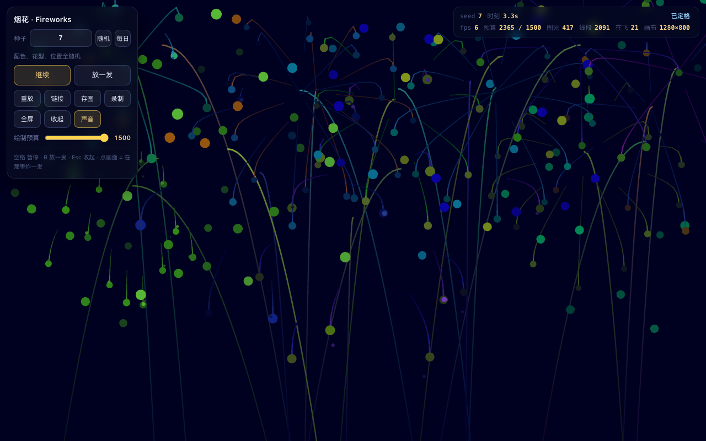
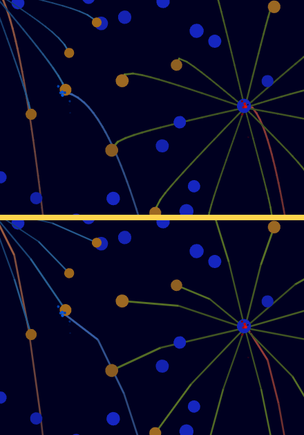
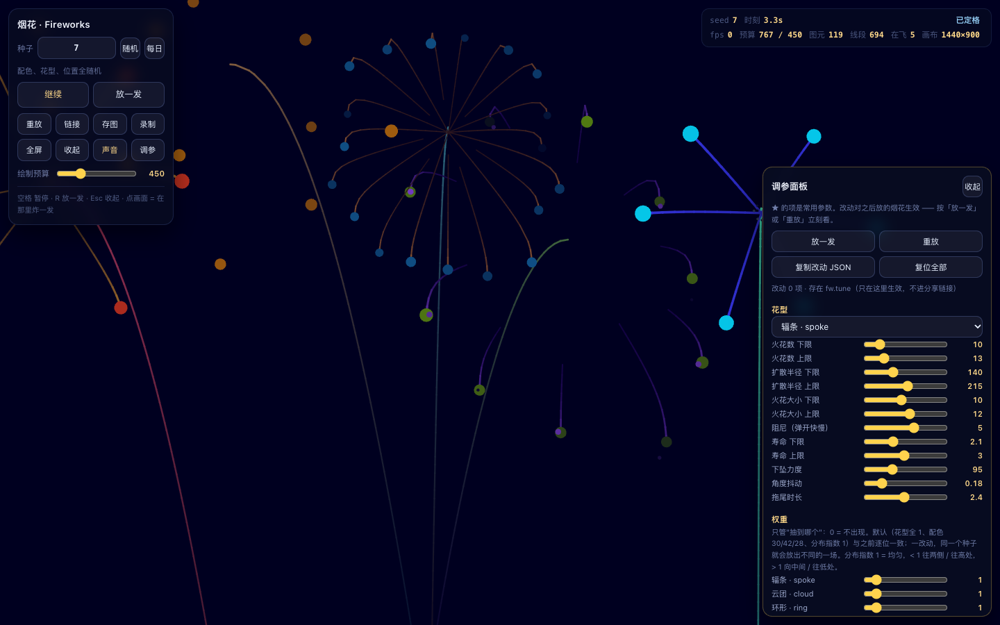

# 烟花 · Fireworks

浏览器里的程序化烟花秀 —— 配色、发射点、爆心、花型、寿命、尾迹全是随机生成的。
**单文件、零依赖、离线可用**：打开网页就能放。



## 马上看

| 方式 | 怎么做 |
| --- | --- |
| **在线版** | <https://cht-1192.github.io/Fireworks/> |
| **入口页** | <https://cht-1192.github.io/> —— 三个纯前端 Demo 的入口（另两个是 2D 光线追踪、网页版示波器） |
| **离线单文件** | 下载 [dist/fireworks.html](dist/fireworks.html)，双击打开。169 KB，零外部请求 |
| **自己跑开发版** | `npm start` → <http://127.0.0.1:9240/>（不需要 `npm install`） |

## 怎么玩

| 想干什么 | 怎么做 |
| --- | --- |
| 放一发 | 按 **R**；或者**点/触摸画面** —— 就在你点的地方炸开 |
| 暂停 / 继续 | **空格** |
| 收起 / 显示面板 | **Esc**（收起后左上角留一个「控制台」按钮） |
| 换一场 | 「随机」换一个数字种子；「每日」回到今天这一场 —— 这个按钮是个**开关**，亮着就会跟着日期自动换（隔天打开、或者页面一直开着跨过午夜，都会自己变成新的一天） |
| 留住这一刻 | 「存图」存 PNG；「录制」录成 WebM（只录画布，界面不会进画面） |
| 分享这一场 | 「链接」复制当前地址；同一个种子永远是同一场 |
| 全屏 | 「全屏」；Esc 退出 |
| 画面太满 / 太空 | 拖「绘制预算」滑块（默认 450） |
| 声音 | 「声音」开关。**没有一个音频文件**：发射、爆炸都是 Web Audio 现场合成的；浏览器要求先有一次点击/按键，所以第一次动手之后才会出声 |
| 调参数 | 点控制台里的「**调参**」，或按 **T**：右下角出现面板（145 项参数 / 53 条滑条，含**出现概率**）。加了 `?tune=1` 则一进来就自动打开 |

**种子是玩法的一半。** `?seed=7` 这样的数字种子每次都会放出同一场，可以贴在链接里发人。

另外还有**一个词**：敲对了会**插播**参考图风格的两发（左右一颗红辐条、一颗绿云团）—— 控制台里
留了提示。照着往种子框里**一个字母一个字母**试：敲对了那个字符会留下来，敲错了会被弹回来；
拼全的那一刻，这两发就插进**正在放的**这一场里，之后照常继续。

那个词**不是种子**，只在你自己屏幕上当场生效一次：**链接、文件名、PNG/WebM 元数据、浏览器存储里
都不会出现它** —— 分享出去的链接里只有数字种子，别人拿不到它。想让人知道，只能自己告诉。

## 你会看到什么

- **一种秀，一次插播**：整场秀只有"随机"这一种，配色/花型/落点全随机；那个词换来的是当场插进
  这一场的两发参考图风格（只在你的屏幕上，带不走；见上）
- **五种花型**：辐条 · 云团 · 环形 · 垂柳 · 棕榈（每种参数见 [docs/styles.md](docs/styles.md)）
- **真实轨迹的尾迹**：火花开始下坠时，拖尾会自己弯成弧线；越旧越暗越细
- **存图与录制都带元数据**：PNG 里写着种子和**这一场的链接**；WebM 里写着种子。
  文件名同样带种子，拿到就能复现同一场



（上：现在的圆头描边；下：移植前 turtle 口径的 2~6 段折线。同一 seed 同一帧，火花位置一致。）

## 可访问性

- **全键盘可用**：Tab 走一遍面板，空格 暂停、R 放一发、Esc 收起；焦点框是可见的（只在键盘操作时画）
- **跟着系统设置走**：开了「减少动效」（`prefers-reduced-motion`）就不自动放烟花、每发也更小 —— 只有你按 R 或点画面才放，面板上会写明原因
- **读屏**：画面（canvas）对读屏是一个有名字的图；操作会在视觉隐藏的 `role="status"` 区域播报（暂停 / 换种子 / 音效开关 / 插播 / 链接已复制…），但**不逐发播报烟花** —— 那是装饰
- 表单都有真的 `label`（种子、绘制预算），HUD 那种每半秒变一次的数字对读屏隐藏

## 调参面板

想改手感不必动代码：点控制台里的「**调参**」（或按 **T**），右下角出现面板 —— 145 项参数里常用的
53 条直接展开成滑条（**包括「抽到哪个」的概率**：花型出现率、配色三种套路的分量、落点分布指数），
其余的都在下面「全部参数（JSON）」里。想让面板一进来就自己打开，就在地址后面加 `?tune=1`
（比如 <https://cht-1192.github.io/Fireworks/?tune=1>）。



- **改了立刻看**：花型、节奏、物理、音效都是**原地读**的，改完按「放一发」或「重放」就是新样子
  （背景色、电平、低通、减少动效降幅这几项是"当场"生效）
- **权重**（「权重」组）：花型出现率（0 = 这一型不出现）、配色三种套路的分量（默认 30/42/28）、
  落点分布指数（1 = 均匀，<1 往两侧/高处，>1 向中间/低处）。默认权重与之前**逐位一致** ——
  同一个种子还是同一场；一旦动过权重，这一场就是新的一场（随机流变了）
- **面板是懒加载的**：没打开之前页面上没有它的节点；`?tune=1` 只是"一进来就自动打开"
- **调参只影响你自己这台机器**：记在 `localStorage` 的 `fw.tune` 里，而且**只存改过的那几项**。
  没调过的人没有这个键，看到（或点开面板时看到）的永远是默认档；分享链接里也不带调参
- **复位全部**把值和那份存储一起清回默认；**复制改动 JSON** 得到一份
  `{"styles.spoke.life": 2.6, ...}` 清单
- **调好了想固化成默认**：把清单里的值写回对应模块（`show.js` 的 `ORCH`、`elements.js` 的 `PHYS`、
  `firework.js` 的 `CFG`、`sound.js` 的 `BUDGET`/`CRISP`/`TONE`、`data.js` 的 `STYLES`、
  `view.js` 的 `BG`），再按一次「复位全部」即可 —— 默认值始终只住在源码里

## 给开发者

这一版是**维护版**：由 `turtle_fireworks.py`（Python + turtle，1171 行）移植而来。原版受
turtle 限制（没有带粗细的折线图元，只能靠图章预算硬凑）已经很难继续加东西，**冻结成历史
基线**；新特性都加在这里。

```bash
npm start          # 开发服务器（零依赖，只用 Node 内置模块）
npm run build      # 打包成单文件 dist/fireworks.html
npm run verify     # 体检 + Node 自检 + 行为基线（日常就这一条）
npm i && npm run browser   # 真浏览器端到端自检（Playwright 驱动系统已装的 Chromium）
```

| 文档 | 内容 |
| --- | --- |
| [docs/checks.md](docs/checks.md) | 三层校验（行为基线 / Node 自检 / 真浏览器）、实测证据、模块地图与目录 |
| [docs/design.md](docs/design.md) | 设计取舍：尾迹为什么用描边、绘制预算为什么是"容量"、为什么固定步长、调参面板为什么只改引用 |
| [docs/usage.md](docs/usage.md) | 全部按钮与快捷键、URL 参数、录制细节、GitHub Pages 托管 |
| [docs/styles.md](docs/styles.md) | 花型参数表（`npm run docs` 从源码生成，含"怎么加一个花型"） |

## 许可

[Apache License 2.0](LICENSE)，版权署名见 [NOTICE](NOTICE)（Copyright 2026 CHT-1192）。
应用本身不依赖任何第三方运行时库；开发期的自检与截图工具用到 `playwright-core`（同为
Apache-2.0）。
